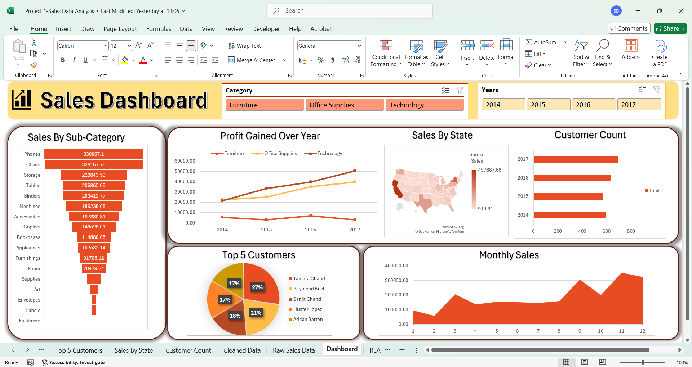

## Project Overview
This project demonstrates how sales data can be analyzed using **Excel** to generate valuable business insights.  
It includes data cleaning, pivot tables, and an interactive dashboard.

## Dataset
- **Source:** 
- Raw sales data obtained from Topmate: [Link](https://topmate.io/ayushi_mishra)
- Data cleaned and transformed in Excel
- Dashboard created based on this dataset

- **Rows:** 9995  
- **Columns:** 9 (Order Date,	Customer Name,	State,	Category,	Sub-Category,	Product Name,	Sales,	Quantity,	Profit)

## Steps Performed
1. **Data Cleaning**
   - Removed duplicates and blanks
   - Fixed incorrect data types  
2. **Analysis**
   - Pivot tables for state-wise & subcategory-wise sales
   - Find Profit Gained Over the Year using Pivot table.
   - Monthly sales calculated through Pivot table.
   - Find out Top 5 customers
   - Find Unique customer count throughout the years (2014 to 2017
   - Applied slicers 
3. **Dashboard**
   - Visualizations: Bar, Line, Pie charts  

## Dashboard Preview

## Key Insights & Report
Download the full report here: [Sales Analysis Report](./4_Sales_Analysis_Report.docx)

## How to Use
Download the Excel workbook here: [Sales Dashboard Workbook](./2_Sales_Dashboard_Workbook.xlsx)

**Steps to use:**
1. Download the workbook from the above link.
2. Open it in Microsoft Excel .
3. Explore the **Raw Data** sheet first to understand the dataset.
4. View the **Dashboard** sheet for visual representation of key metrics.
5. Use slicers to explore data  

##  Author
👤 **Shivank Dixit**  
📧 [shivankdixit730@gmail.com]  
🔗 [LinkedIn Profile](https://www.linkedin.com/in/shivank-dixit-b61a3623b)

